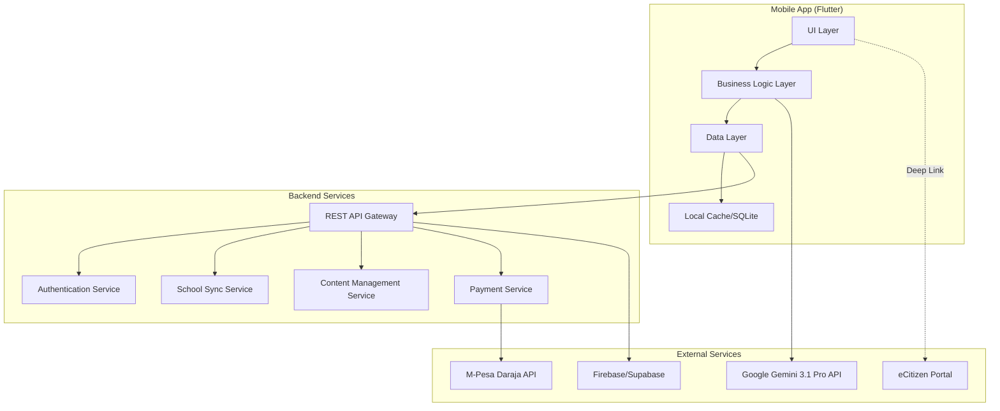

# Design Document: B2C Learner App

## Overview

The B2C Learner App is a Flutter-based mobile application that provides AI-powered driver training for Kenyan learner drivers. The app integrates with Google Gemini 3.1 Pro for conversational tutoring, implements offline-first architecture for rural accessibility, and enforces NTSA curriculum standards (LN 28 of 2020) throughout the learning experience.

The app operates within a larger ecosystem that includes driving school management systems, but this design focuses exclusively on the learner-facing mobile application. The app syncs with driving schools through a backend API but does not implement school management features.

### Design Goals

1. **Offline-First Architecture**: Core learning features must work without internet connectivity
2. **Low-Resource Optimization**: Support devices with 2GB RAM and limited storage
3. **NTSA Compliance**: Enforce 80% pass mark and align 100% with official curriculum
4. **Bilingual Support**: Seamless English/Swahili experience throughout
5. **School Integration**: Sync learning progress with registered driving schools
6. **Scalability**: Support 20,000+ concurrent users in Year 1

## Architecture

### High-Level Architecture



### Architectural Patterns

**1. Offline-First with Sync**
- Local SQLite database stores all downloaded content
- Background sync service reconciles local changes with server when online
- Conflict resolution prioritizes server state for curriculum content, local state for user progress

**2. Repository Pattern**
- Abstract data sources behind repository interfaces
- Repositories handle switching between local cache and remote API
- Enables testing and future data source changes

**3. BLoC (Business Logic Component) Pattern**
- Separates business logic from UI
- Reactive state management using streams
- Testable business logic independent of Flutter framework

**4. Service Layer**
- Dedicated services for AI tutoring, mock testing, content delivery
- Services are injected via dependency injection
- Enables mocking for testing

### Technology Stack

**Frontend:**
- Flutter 3.x (Dart)
- flutter_bloc for state management
- sqflite for local database
- dio for HTTP requests
- shared_preferences for simple key-value storage

**Backend:**
- Firebase/Supabase for backend-as-a-service
- Cloud Functions for serverless compute
- Cloud Storage for media files
- Firestore/PostgreSQL for structured data

**External APIs:**
- Google Gemini 3.1 Pro for AI tutoring
- M-Pesa Daraja API for payments
- eCitizen (deep linking only, no API integration)

## Components and Interfaces

### 1. Authentication Module

**Responsibilities:**
- User registration with phone number
- SMS-based verification
- Password management and reset
- Session management
- Token refresh

**Key Classes:**

```dart
class AuthenticationService {
  Future<AuthResult> registerWithPhone(String phoneNumber, String password);
  Future<void> sendVerificationCode(String phoneNumber);
  Future<AuthResult> verifyCode(String phoneNumber, String code);
  Future<AuthResult> login(String phoneNumber, String password);
  Future<void> resetPassword(String phoneNumber);
  Future<void> logout();
  Stream<AuthState> get authStateChanges;
}

class AuthResult {
  final bool success;
  final User? user;
  final String? errorMessage;
}

class User {
  final String id;
  final String phoneNumber;
  final String name;
  final LicenseCategory category;
  final String? drivingSchoolId;
  final SubscriptionStatus subscriptionStatus;
}
```

### 2. Content Management Module

**Responsibilities:**
- Download and cache theory modules
- Manage offline content availability
- Sync content updates from server
- Organize content by license category and Common Core Units
- Serve videos, images, and text content

**Key Classes:**

```dart
class ContentRepository {
  Future<List<Module>> getModules(LicenseCategory category);
  Future<Module> getModuleById(String moduleId);
  Future<void> downloadModuleForOffline(String moduleId);
  Future<bool> isModuleAvailableOffline(String moduleId);
  Future<void> syncContentUpdates();
  Stream<DownloadProgress> downloadProgress(String moduleId);
}

class Module {
  final String id;
  final String title;
  final String titleSwahili;
  final ModuleType type; // CommonCore or CategorySpecific
  final LicenseCategory? category;
  final List<Lesson> lessons;
  final bool isDownloaded;
}

class Lesson {
  final String id;
  final String title;
  final String titleSwahili;
  final String content;
  final String contentSwahili;
  final List<MediaAsset> media;
  final List<RoadSign> roadSigns;
}

class MediaAsset {
  final String id;
  final MediaType type; // Video, Image, Diagram
  final String url;
  final String? localPath;
  final int sizeBytes;
}
```

### 3. AI Tutor Module

**Responsibilities:**
- Interface with Gemini 3.1 Pro API
- Manage conversation context and history
- Cache common responses for offline access
- Detect language (English/Swahili) and respond accordingly
- Provide context-aware responses based on user progress

**Key Classes:**

```dart
class AITutorService {
  Future<TutorResponse> askQuestion(String question, {Language? language});
  Future<List<StudyRecommendation>> getPersonalizedRecommendations(User user);
  Future<void> cacheCommonResponses();
  Stream<TutorResponse> streamResponse(String question);
}

class TutorResponse {
  final String question;
  final String answer;
  final Language language;
  final List<String> relatedTopics;
  final List<RoadSign>? visualReferences;
  final bool fromCache;
}

class StudyRecommendation {
  final String moduleId;
  final String reason;
  final Priority priority;
}

enum Language { english, swahili }
```

**Gemini Integration Strategy:**
- System prompt includes NTSA curriculum context and user's license category
- Conversation history limited to last 10 exchanges to manage token costs
- Responses validated against curriculum to prevent hallucinations
- Fallback to cached responses when API unavailable or rate-limited

### 4. Mock Test Engine

**Responsibilities:**
- Generate 50-question tests from question bank
- Enforce NTSA test format and timing
- Evaluate answers and calculate scores
- Enforce 80% pass mark
- Provide detailed explanations for all answers
- Track test history and performance analytics

**Key Classes:**

```dart
class MockTestEngine {
  Future<MockTest> generateTest(LicenseCategory category);
  Future<TestResult> submitTest(MockTest test, Map<String, String> answers);
  Future<List<TestResult>> getTestHistory(String userId);
  Future<PerformanceAnalytics> analyzePerformance(String userId);
}

class MockTest {
  final String id;
  final LicenseCategory category;
  final List<Question> questions;
  final DateTime startTime;
  final Duration timeLimit;
  final int passMark; // Always 40 out of 50
}

class Question {
  final String id;
  final String text;
  final String textSwahili;
  final List<String> options;
  final List<String> optionsSwahili;
  final String correctAnswer;
  final String explanation;
  final String explanationSwahili;
  final CurriculumTopic topic;
}

class TestResult {
  final String testId;
  final int score;
  final int totalQuestions;
  final bool passed; // score >= 40
  final Duration timeTaken;
  final Map<CurriculumTopic, int> topicScores;
  final List<String> weakAreas;
}

class PerformanceAnalytics {
  final double averageScore;
  final int totalTestsTaken;
  final int testsPassed;
  final List<CurriculumTopic> weakestTopics;
  final List<CurriculumTopic> strongestTopics;
  final TrendData scoreTrend;
}
```

**Test Generation Algorithm:**
- Questions distributed proportionally across curriculum topics
- Ensures coverage of all Common Core Units
- Includes category-specific questions based on user's license type
- Randomizes question and option order
- Prevents duplicate questions within same test
- Maintains difficulty balance (30% easy, 50% medium, 20% hard)

### 5. School Sync Module

**Responsibilities:**
- Link user account to driving school
- Sync module unlock schedule from school
- Share progress data with school
- Handle school code validation

**Key Classes:**

```dart
class SchoolSyncService {
  Future<DrivingSchool> linkToSchool(String schoolCode);
  Future<void> syncModuleSchedule();
  Future<void> shareProgressWithSchool(ProgressReport report);
  Future<bool> isModuleUnlocked(String moduleId);
  Stream<ModuleUnlockEvent> get moduleUnlockStream;
}

class DrivingSchool {
  final String id;
  final String name;
  final String code;
  final List<String> instructors;
  final ModuleSchedule schedule;
}

class ModuleSchedule {
  final Map<String, DateTime> moduleUnlockDates;
  final List<String> unlockedModules;
}

class ProgressReport {
  final String userId;
  final String schoolId;
  final double completionPercentage;
  final int studyHours;
  final List<TestResult> recentTests;
  final DateTime generatedAt;
}
```

### 6. Progress Tracking Module

**Responsibilities:**
- Track study time per module
- Calculate completion percentages
- Manage achievement badges
- Track daily streaks
- Generate progress visualizations

**Key Classes:**

```dart
class ProgressTracker {
  Future<void> recordStudySession(String moduleId, Duration duration);
  Future<ProgressSummary> getProgressSummary(String userId);
  Future<List<Achievement>> getAchievements(String userId);
  Future<void> awardBadge(String userId, BadgeType badge);
  Future<int> getCurrentStreak(String userId);
  Stream<ProgressUpdate> get progressStream;
}

class ProgressSummary {
  final double overallCompletion;
  final Map<String, double> moduleCompletion;
  final int totalStudyMinutes;
  final int currentStreak;
  final List<Achievement> recentAchievements;
}

class Achievement {
  final String id;
  final BadgeType type;
  final String title;
  final String titleSwahili;
  final String description;
  final String descriptionSwahili;
  final DateTime earnedAt;
}

enum BadgeType {
  firstTest,
  firstPass,
  threeConsecutivePasses,
  readyForNTSA,
  weekStreak,
  monthStreak,
  moduleComplete,
  allModulesComplete
}
```

### 7. Payment Module

**Responsibilities:**
- Process M-Pesa payments
- Manage subscription status
- Apply promo codes and referral discounts
- Track school commission allocations
- Handle payment failures and retries

**Key Classes:**

```dart
class PaymentService {
  Future<PaymentResult> initiatePayment(PaymentRequest request);
  Future<PaymentStatus> checkPaymentStatus(String transactionId);
  Future<bool> applyPromoCode(String code);
  Future<SubscriptionStatus> getSubscriptionStatus(String userId);
  Future<void> processRefund(String transactionId);
}

class PaymentRequest {
  final String userId;
  final PaymentType type; // OneTime or Monthly
  final int amount;
  final String phoneNumber;
  final String? promoCode;
  final String? referralCode;
}

class PaymentResult {
  final bool success;
  final String? transactionId;
  final String? errorMessage;
  final DateTime? expiryDate; // For subscriptions
}

enum SubscriptionStatus {
  free,
  premiumOneTime,
  premiumMonthly,
  expired
}
```

**M-Pesa Integration Flow:**
1. User initiates payment in app
2. App calls backend payment service
3. Backend initiates STK push via Daraja API
4. User enters M-Pesa PIN on phone
5. Backend receives callback from M-Pesa
6. Backend updates user subscription status
7. App polls for status update or receives push notification
8. Premium features unlocked within 30 seconds

### 8. 3D Model Town Module

**Responsibilities:**
- Render interactive 3D traffic scenarios
- Handle drag-and-drop interactions
- Provide real-time feedback on decisions
- Track scenario completion

**Key Classes:**

```dart
class ModelTownService {
  Future<List<TrafficScenario>> getScenarios(LicenseCategory category);
  Future<ScenarioResult> evaluateScenario(String scenarioId, UserActions actions);
  Future<void> recordScenarioCompletion(String userId, String scenarioId);
}

class TrafficScenario {
  final String id;
  final String title;
  final String titleSwahili;
  final String description;
  final String descriptionSwahili;
  final ScenarioType type; // Intersection, Roundabout, Parking, etc.
  final List<TrafficElement> elements;
  final List<String> learningObjectives;
}

class TrafficElement {
  final String id;
  final ElementType type; // Vehicle, Sign, Pedestrian, TrafficLight
  final Position3D position;
  final bool isDraggable;
}

class UserActions {
  final List<ElementPlacement> placements;
  final List<Decision> decisions;
}

class ScenarioResult {
  final bool correct;
  final int score;
  final String feedback;
  final String feedbackSwahili;
  final List<String> mistakes;
}
```

### 9. Notification Module

**Responsibilities:**
- Schedule study reminders
- Send achievement notifications
- Notify about module unlocks
- Alert about subscription expiry

**Key Classes:**

```dart
class NotificationService {
  Future<void> scheduleStudyReminder(TimeOfDay time, List<DayOfWeek> days);
  Future<void> sendAchievementNotification(Achievement achievement);
  Future<void> sendModuleUnlockNotification(Module module);
  Future<void> cancelAllNotifications();
  Future<NotificationSettings> getSettings(String userId);
  Future<void> updateSettings(NotificationSettings settings);
}

class NotificationSettings {
  final bool studyRemindersEnabled;
  final TimeOfDay? reminderTime;
  final List<DayOfWeek> reminderDays;
  final bool achievementNotificationsEnabled;
  final bool moduleUnlockNotificationsEnabled;
}
```

## Data Models

### Core Entities

**User Profile:**
```dart
class UserProfile {
  final String id;
  final String phoneNumber;
  final String name;
  final LicenseCategory targetCategory;
  final Language preferredLanguage;
  final String? drivingSchoolId;
  final SubscriptionStatus subscriptionStatus;
  final DateTime? subscriptionExpiryDate;
  final DateTime createdAt;
  final DateTime lastActiveAt;
}
```

**License Categories:**
```dart
enum LicenseCategory {
  A1, // Motorcycles up to 50cc
  A2, // Motorcycles 50cc-500cc
  A3, // Motorcycles above 500cc
  B1, // Light vehicles up to 3,000kg
  B2, // Light vehicles 3,000-5,000kg
  B3, // Light vehicles above 5,000kg
  C,  // Medium goods vehicles
  D,  // Public service vehicles (PSV)
  E,  // Professional drivers
  F,  // Tractors and special vehicles
  G   // Articulated vehicles
}
```

**Curriculum Structure:**
```dart
class CurriculumTopic {
  final String id;
  final String name;
  final String nameSwahili;
  final TopicCategory category;
  final bool isCommonCore;
  final List<LicenseCategory> applicableCategories;
}

enum TopicCategory {
  roadSigns,
  trafficRules,
  vehicleControls,
  defensiveDriving,
  emergencyProcedures,
  humanFactors,
  vehicleMaintenance,
  environmentalAwareness
}
```

### Local Database Schema

**SQLite Tables:**

```sql
-- User data
CREATE TABLE users (
  id TEXT PRIMARY KEY,
  phone_number TEXT UNIQUE NOT NULL,
  name TEXT NOT NULL,
  license_category TEXT NOT NULL,
  preferred_language TEXT NOT NULL,
  driving_school_id TEXT,
  subscription_status TEXT NOT NULL,
  subscription_expiry_date INTEGER,
  created_at INTEGER NOT NULL,
  last_active_at INTEGER NOT NULL
);

-- Downloaded modules
CREATE TABLE modules (
  id TEXT PRIMARY KEY,
  title TEXT NOT NULL,
  title_swahili TEXT NOT NULL,
  type TEXT NOT NULL,
  category TEXT,
  is_downloaded INTEGER NOT NULL DEFAULT 0,
  download_date INTEGER,
  last_updated INTEGER NOT NULL
);

-- Lessons within modules
CREATE TABLE lessons (
  id TEXT PRIMARY KEY,
  module_id TEXT NOT NULL,
  title TEXT NOT NULL,
  title_swahili TEXT NOT NULL,
  content TEXT NOT NULL,
  content_swahili TEXT NOT NULL,
  order_index INTEGER NOT NULL,
  FOREIGN KEY (module_id) REFERENCES modules(id)
);

-- Media assets
CREATE TABLE media_assets (
  id TEXT PRIMARY KEY,
  lesson_id TEXT NOT NULL,
  type TEXT NOT NULL,
  url TEXT NOT NULL,
  local_path TEXT,
  size_bytes INTEGER NOT NULL,
  is_downloaded INTEGER NOT NULL DEFAULT 0,
  FOREIGN KEY (lesson_id) REFERENCES lessons(id)
);

-- Test questions
CREATE TABLE questions (
  id TEXT PRIMARY KEY,
  text TEXT NOT NULL,
  text_swahili TEXT NOT NULL,
  correct_answer TEXT NOT NULL,
  explanation TEXT NOT NULL,
  explanation_swahili TEXT NOT NULL,
  topic_id TEXT NOT NULL,
  difficulty TEXT NOT NULL
);

-- Question options
CREATE TABLE question_options (
  id TEXT PRIMARY KEY,
  question_id TEXT NOT NULL,
  option_text TEXT NOT NULL,
  option_text_swahili TEXT NOT NULL,
  option_key TEXT NOT NULL,
  FOREIGN KEY (question_id) REFERENCES questions(id)
);

-- Test history
CREATE TABLE test_results (
  id TEXT PRIMARY KEY,
  user_id TEXT NOT NULL,
  test_id TEXT NOT NULL,
  score INTEGER NOT NULL,
  total_questions INTEGER NOT NULL,
  passed INTEGER NOT NULL,
  time_taken_seconds INTEGER NOT NULL,
  completed_at INTEGER NOT NULL,
  FOREIGN KEY (user_id) REFERENCES users(id)
);

-- Progress tracking
CREATE TABLE study_sessions (
  id TEXT PRIMARY KEY,
  user_id TEXT NOT NULL,
  module_id TEXT NOT NULL,
  duration_seconds INTEGER NOT NULL,
  session_date INTEGER NOT NULL,
  FOREIGN KEY (user_id) REFERENCES users(id),
  FOREIGN KEY (module_id) REFERENCES modules(id)
);

-- Achievements
CREATE TABLE achievements (
  id TEXT PRIMARY KEY,
  user_id TEXT NOT NULL,
  badge_type TEXT NOT NULL,
  earned_at INTEGER NOT NULL,
  FOREIGN KEY (user_id) REFERENCES users(id)
);

-- Cached AI responses
CREATE TABLE ai_cache (
  id TEXT PRIMARY KEY,
  question_hash TEXT UNIQUE NOT NULL,
  question TEXT NOT NULL,
  answer TEXT NOT NULL,
  language TEXT NOT NULL,
  cached_at INTEGER NOT NULL,
  access_count INTEGER NOT NULL DEFAULT 0
);

-- Sync metadata
CREATE TABLE sync_metadata (
  key TEXT PRIMARY KEY,
  value TEXT NOT NULL,
  last_synced INTEGER NOT NULL
);
```

### Backend API Data Models

**API Request/Response Formats:**

```typescript
// User registration
interface RegisterRequest {
  phoneNumber: string;
  password: string;
  name: string;
  licenseCategory: LicenseCategory;
  preferredLanguage: 'english' | 'swahili';
  drivingSchoolCode?: string;
}

interface RegisterResponse {
  success: boolean;
  userId?: string;
  verificationRequired: boolean;
  error?: string;
}

// Content sync
interface ContentSyncRequest {
  userId: string;
  lastSyncTimestamp: number;
  licenseCategory: LicenseCategory;
}

interface ContentSyncResponse {
  modules: Module[];
  deletedModuleIds: string[];
  serverTimestamp: number;
}

// School linking
interface SchoolLinkRequest {
  userId: string;
  schoolCode: string;
}

interface SchoolLinkResponse {
  success: boolean;
  school?: DrivingSchool;
  moduleSchedule?: ModuleSchedule;
  error?: string;
}

// Payment initiation
interface PaymentInitRequest {
  userId: string;
  paymentType: 'one_time' | 'monthly';
  phoneNumber: string;
  promoCode?: string;
  referralCode?: string;
}

interface PaymentInitResponse {
  success: boolean;
  transactionId?: string;
  checkoutRequestId?: string;
  error?: string;
}
```

## Error Handling

### Error Categories

**1. Network Errors**
- No internet connection
- Timeout
- Server unavailable
- Rate limiting

**Strategy:**
- Graceful degradation to offline mode
- Queue operations for retry when online
- Clear user messaging about offline status
- Automatic retry with exponential backoff

**2. Authentication Errors**
- Invalid credentials
- Expired session
- SMS verification failure
- Account locked

**Strategy:**
- Clear error messages in user's language
- Automatic token refresh for expired sessions
- Retry mechanism for SMS delivery
- Account recovery flow for locked accounts

**3. Payment Errors**
- Insufficient funds
- M-Pesa timeout
- Transaction cancelled
- Invalid phone number

**Strategy:**
- Detailed error messages from M-Pesa
- Retry option with same or different number
- Support contact information
- Transaction history for reference

**4. Content Errors**
- Download failure
- Corrupted files
- Missing media
- Storage full

**Strategy:**
- Resume interrupted downloads
- Verify file integrity with checksums
- Fallback to streaming for missing offline content
- Storage management UI to free space

**5. AI Tutor Errors**
- API rate limit exceeded
- Invalid response
- Timeout
- Inappropriate content detection

**Strategy:**
- Fallback to cached responses
- Queue questions for retry
- Content filtering and validation
- Clear messaging about temporary unavailability

### Error Response Format

```dart
class AppError {
  final ErrorType type;
  final String message;
  final String messageSwahili;
  final ErrorSeverity severity;
  final bool isRetryable;
  final Map<String, dynamic>? metadata;
}

enum ErrorType {
  network,
  authentication,
  payment,
  content,
  aiTutor,
  validation,
  unknown
}

enum ErrorSeverity {
  info,
  warning,
  error,
  critical
}
```

### Logging and Monitoring

**Local Logging:**
- Log all errors to local database
- Include timestamp, user context, and stack trace
- Limit log retention to 30 days
- Exclude sensitive data (passwords, payment info)

**Remote Monitoring:**
- Send critical errors to Firebase Crashlytics
- Track API response times and failure rates
- Monitor payment success/failure rates
- Track AI tutor response quality metrics

## Testing Strategy

The B2C Learner App requires a comprehensive testing approach that combines unit tests for specific examples and edge cases with property-based tests for universal correctness properties. This dual approach ensures both concrete functionality and general correctness across all inputs.

### Testing Framework Selection

**Unit Testing:**
- Flutter's built-in test framework
- mockito for mocking dependencies
- flutter_test for widget testing

**Property-Based Testing:**
- Use **fast_check** (Dart port) or **test_check** library for property-based testing
- Each property test configured to run minimum 100 iterations
- Random seed logging for reproducibility

### Test Organization

Tests are organized by module with both unit tests and property tests:

```
test/
├── unit/
│   ├── auth/
│   ├── content/
│   ├── ai_tutor/
│   ├── mock_test/
│   └── ...
├── property/
│   ├── auth_properties_test.dart
│   ├── content_properties_test.dart
│   ├── mock_test_properties_test.dart
│   └── ...
├── widget/
├── integration/
└── test_helpers/
```

### Unit Testing Strategy

Unit tests focus on:
- Specific examples demonstrating correct behavior
- Edge cases (empty inputs, boundary values, null handling)
- Error conditions and exception handling
- Integration points between components
- UI widget behavior

**Example Unit Tests:**
- User registration with valid phone number succeeds
- Login with incorrect password fails with appropriate error
- Mock test with exactly 40 correct answers passes
- Mock test with 39 correct answers fails
- Payment with invalid promo code returns error
- Content download resumes after interruption

### Property-Based Testing Strategy

Property tests verify universal properties that should hold for all valid inputs. Each property test:
- Runs minimum 100 iterations with randomized inputs
- References the design document property number
- Includes a comment tag: `// Feature: b2c-learner-app, Property {N}: {property_text}`
- Tests one correctness property from the design document

### Test Coverage Goals

- Unit test coverage: 80% minimum
- Property test coverage: All testable acceptance criteria
- Widget test coverage: All critical user flows
- Integration test coverage: End-to-end scenarios

### Continuous Integration

- Run all tests on every commit
- Block merges if tests fail
- Generate coverage reports
- Track test execution time
- Alert on flaky tests

### Performance Testing

- App launch time < 5 seconds on low-end devices
- Module download progress updates every second
- Mock test question rendering < 500ms
- AI tutor response streaming starts within 2 seconds
- Offline mode switching < 1 second

### Accessibility Testing

- Screen reader compatibility
- Minimum touch target size (48x48dp)
- Color contrast ratios (WCAG AA)
- Text scaling support
- Keyboard navigation (for tablets)


## Correctness Properties

A property is a characteristic or behavior that should hold true across all valid executions of a system—essentially, a formal statement about what the system should do. Properties serve as the bridge between human-readable specifications and machine-verifiable correctness guarantees.

### Property 1: School Linking Establishes Bidirectional Relationship

*For any* valid school code and user account, when a user registers with that school code, the School_Sync_Service should link the user to the school AND the school should have that user in its student list.

**Validates: Requirements 2.1**

### Property 2: Module Unlocking Respects Schedule

*For any* teaching schedule and current date, the School_Sync_Service should only unlock modules whose scheduled unlock date is on or before the current date.

**Validates: Requirements 2.2**

### Property 3: License Category Determines Module Set

*For any* license category selection, the Content_Manager should return all Common Core Units plus all category-specific modules for that category, and no modules for other categories.

**Validates: Requirements 2.5**

### Property 4: Progress Sharing Preserves Data Integrity

*For any* user progress data, when shared with a driving school, the shared data should accurately reflect the user's actual completion percentage, study hours, and test results without modification.

**Validates: Requirements 2.6**

### Property 5: AI Tutor Language Consistency

*For any* question asked in a specific language (English or Swahili), the AI_Tutor should respond in the same language, and all visual references should use labels in that language.

**Validates: Requirements 3.2, 9.5**

### Property 6: Road Sign Questions Include Visual References

*For any* question about road signs, the AI_Tutor response should include at least one visual reference (image or diagram) of the relevant road sign.

**Validates: Requirements 3.4**

### Property 7: Personalized Recommendations Based on Weak Areas

*For any* user with test history, the AI_Tutor should generate study recommendations that prioritize the user's three weakest curriculum topics based on test performance.

**Validates: Requirements 3.7**

### Property 8: All Topics Have Multimedia Content

*For any* curriculum topic, the Content_Manager should provide at least one instructional video AND at least one visual learning aid (diagram or illustration).

**Validates: Requirements 4.2, 4.7**

### Property 9: Model Town Interactions Provide Feedback

*For any* user interaction with a Model Town scenario (placing elements or making decisions), the system should provide immediate feedback indicating whether the action was correct or incorrect with an explanation.

**Validates: Requirements 4.5**

### Property 10: Mock Tests Have Exactly 50 Questions

*For any* generated mock test, the Mock_Test_Engine should create exactly 50 questions with all questions drawn from curriculum areas relevant to the user's license category.

**Validates: Requirements 5.1, 5.8**

### Property 11: Pass Mark Enforcement at 80%

*For any* completed mock test, the test should be marked as "passed" if and only if the score is 40 or more correct answers out of 50 (80% or higher).

**Validates: Requirements 5.2**

### Property 12: Test Time Limits Applied Consistently

*For any* mock test, when started, the Mock_Test_Engine should enforce a time limit, and when the time expires, the test should automatically submit with only answered questions counted.

**Validates: Requirements 5.3**

### Property 13: All Test Questions Have Explanations

*For any* completed mock test, every question should have a detailed explanation available regardless of whether the user answered it correctly or incorrectly.

**Validates: Requirements 5.4**

### Property 14: Performance Analytics Identify Weak Areas

*For any* user with at least three completed tests, the Mock_Test_Engine should identify the three curriculum topics with the lowest average scores as weak areas.

**Validates: Requirements 5.5, 12.2**

### Property 15: Badge Award After Three Consecutive Passes

*For any* sequence of test results, the "Ready for NTSA" badge should be awarded if and only if the three most recent tests all have scores of 80% or higher (40+ out of 50).

**Validates: Requirements 5.6**

### Property 16: Certificate Generation for Consistent Passers

*For any* user who has passed at least 5 mock tests with an average score of 80% or higher, the system should generate a shareable Certificate of Competence.

**Validates: Requirements 5.7**

### Property 17: Module Download Enables Offline Access

*For any* theory module, after successful download, all lessons and media assets within that module should be accessible without internet connectivity.

**Validates: Requirements 6.1**

### Property 18: Offline Mock Tests Function Identically

*For any* mock test taken offline, the test format, question count, scoring logic, and explanation availability should be identical to online tests.

**Validates: Requirements 6.2**

### Property 19: Progress Sync Preserves All Changes

*For any* user progress changes made offline (study time, test completions, module progress), when connectivity is restored, all changes should be synchronized to the cloud without data loss.

**Validates: Requirements 6.3**

### Property 20: Cached Questions Accessible Offline

*For any* question in the AI_Tutor cache, when asked offline, the cached response should be returned with the same content as if asked online.

**Validates: Requirements 6.5**

### Property 21: Offline Content Clearly Indicated

*For any* content item (module, lesson, video), the UI should display an indicator showing whether it is available offline or requires connectivity.

**Validates: Requirements 6.7**

### Property 22: Study Time Accumulation

*For any* sequence of study sessions for a user, the Progress_Tracker should calculate total study time as the sum of all session durations.

**Validates: Requirements 7.1, 12.4**

### Property 23: Completion Percentage Calculation

*For any* module with N lessons, if a user has completed M lessons, the Progress_Tracker should display completion percentage as (M/N) × 100%.

**Validates: Requirements 7.2**

### Property 24: Streak Calculation Accuracy

*For any* sequence of study dates, the Progress_Tracker should calculate the current streak as the number of consecutive days (ending with today) on which the user studied for at least 1 minute.

**Validates: Requirements 7.3**

### Property 25: Milestone Badge Awards

*For any* user achievement (first test, first pass, week streak, etc.), when the milestone condition is met, the corresponding achievement badge should be awarded exactly once.

**Validates: Requirements 7.4**

### Property 26: Leaderboard Ranking Accuracy

*For any* user who has opted into leaderboards, their displayed rank should match their position when all users in their driving school are sorted by a consistent metric (e.g., total study time or average test score).

**Validates: Requirements 7.5**

### Property 27: Notification Scheduling Respects Preferences

*For any* user notification preferences (time and days), study reminder notifications should be sent only on the specified days at the specified time.

**Validates: Requirements 7.6**

### Property 28: Progress Indicators for All Modules

*For any* curriculum module, the Progress_Tracker should display a visual indicator showing the percentage of lessons completed within that module.

**Validates: Requirements 7.7**

### Property 29: Payment Processing and Feature Unlocking

*For any* successful payment (one-time or monthly subscription), the Payment_Gateway should update the user's subscription status and unlock premium features.

**Validates: Requirements 8.2, 8.3**

### Property 30: School Commission Calculation

*For any* premium payment made by a user linked to a driving school, the Payment_Gateway should allocate exactly 20% of the payment amount to that school's commission balance.

**Validates: Requirements 8.5**

### Property 31: Promo Code Discount Application

*For any* valid promo code, when applied to a payment, the Payment_Gateway should reduce the payment amount by the discount percentage or fixed amount specified by the promo code.

**Validates: Requirements 8.6**

### Property 32: Referral Discount Processing

*For any* user who signs up using a valid referral code, both the referrer and the new user should receive the specified referral discount on their next premium purchase.

**Validates: Requirements 8.7**

### Property 33: Payment Failure Error Handling

*For any* failed payment attempt, the Payment_Gateway should return a specific error message indicating the failure reason (insufficient funds, timeout, cancelled, etc.) and provide a retry option.

**Validates: Requirements 8.8**

### Property 34: UI Language Completeness

*For any* user interface element (button, label, message, instruction), translations should exist in both English and Swahili.

**Validates: Requirements 9.1**

### Property 35: Language Selection Affects All Content

*For any* language selection change, all displayed content (UI elements, theory content, test questions, AI responses) should immediately update to the selected language.

**Validates: Requirements 9.2**

### Property 36: Theory Content Bilingual Availability

*For any* theory content item (lesson, explanation, instruction), both English and Swahili versions should be available and semantically equivalent.

**Validates: Requirements 9.3**

### Property 37: Test Questions in Selected Language

*For any* generated mock test, all questions and answer options should be in the user's currently selected language.

**Validates: Requirements 9.4**

### Property 38: User Registration with Valid Credentials

*For any* valid phone number (10 digits starting with 07 or 01) and password (minimum 8 characters), the registration process should create a new user account and send a verification code.

**Validates: Requirements 11.1, 11.2**

### Property 39: Password Reset Flow Completion

*For any* registered phone number, the password reset flow should send a verification code, validate the code, and allow setting a new password.

**Validates: Requirements 11.3**

### Property 40: Profile Update Persistence

*For any* user profile field update (name, license category, driving school), the change should be persisted to the database and reflected immediately in the user's profile.

**Validates: Requirements 11.6**

### Property 41: Performance Trend Visualization

*For any* user with at least two test results, the Progress_Tracker should display a visual chart showing score trends over time with dates on the x-axis and scores on the y-axis.

**Validates: Requirements 12.1**

### Property 42: Average Score Calculation

*For any* user with N completed tests with scores S1, S2, ..., SN, the Progress_Tracker should calculate and display the average score as (S1 + S2 + ... + SN) / N.

**Validates: Requirements 12.3**

### Property 43: Actionable Study Recommendations

*For any* user viewing analytics, if weak areas are identified, the system should provide at least one specific study recommendation for each weak area (e.g., "Review Module X: Traffic Signs").

**Validates: Requirements 12.5**

### Property 44: School Average Comparison

*For any* user linked to a driving school, the Progress_Tracker should display the user's average test score alongside the anonymized average score of all users in that school.

**Validates: Requirements 12.6**