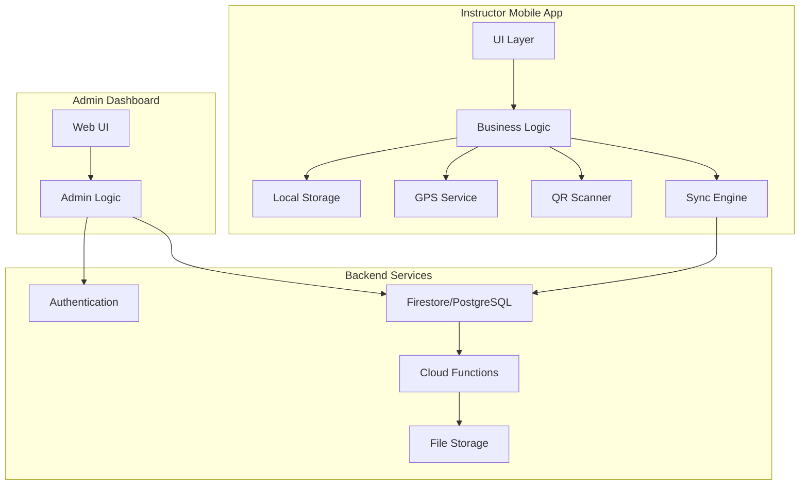
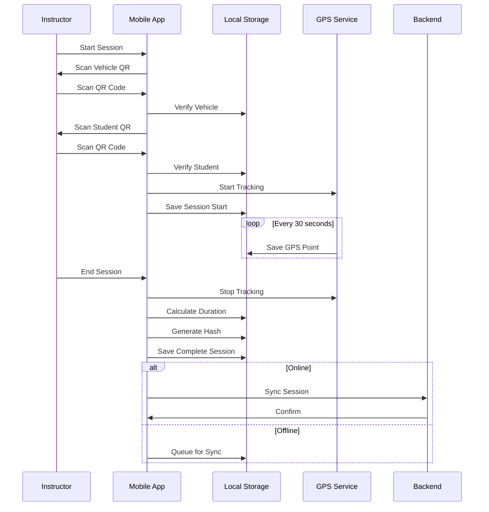

# Design Document: B2B Instructor Digital Logbook

## Overview

The B2B Instructor Digital Logbook is a distributed mobile-first system that provides tamper-proof verification of practical driver training hours. The architecture follows a client-server model with offline-first capabilities, ensuring instructors can log training sessions in areas with poor connectivity while maintaining data integrity and NTSA compliance.

### Key Design Principles

1. **Offline-First**: The mobile app must function without internet connectivity, with automatic synchronization when online
2. **Tamper-Proof**: All training session records are cryptographically signed and immutable after completion
3. **GPS Verification**: Every training session includes GPS tracking to verify authenticity
4. **Simple UX**: Designed for instructors with varying levels of tech literacy
5. **Audit Compliance**: All data structures and reports meet NTSA audit requirements

### System Components

1. **Instructor Mobile App** (Flutter): Primary interface for logging training sessions
2. **Admin Web Dashboard** (Flutter Web): Management interface for driving schools
3. **Backend Services** (Firebase/Supabase): Authentication, data storage, and synchronization
4. **Sync Engine**: Handles offline data persistence and background synchronization
5. **Report Generator**: Creates NTSA-compliant PDF reports with verification codes

## Architecture

### High-Level Architecture



### Data Flow: Training Session Lifecycle



### Technology Stack

**Mobile App (Flutter)**
- **State Management**: Provider or Riverpod
- **Local Storage**: SQLite (sqflite package) for structured data, Hive for key-value storage
- **GPS Tracking**: geolocator package
- **QR Code**: qr_flutter (generation), mobile_scanner (scanning)
- **Offline Sync**: Custom sync engine with connectivity_plus package
- **Authentication**: firebase_auth or supabase_flutter

**Backend (Firebase Option)**
- **Authentication**: Firebase Authentication
- **Database**: Cloud Firestore
- **Storage**: Firebase Storage (for QR codes, reports)
- **Functions**: Cloud Functions for report generation and validation
- **Hosting**: Firebase Hosting for admin dashboard

**Backend (Supabase Option)**
- **Authentication**: Supabase Auth
- **Database**: PostgreSQL with Row Level Security
- **Storage**: Supabase Storage
- **Functions**: Edge Functions for report generation
- **Hosting**: Vercel or Netlify for admin dashboard

**Recommended**: Firebase for faster development and better offline support, Supabase for more control and lower long-term costs.

## Components and Interfaces

### 1. Authentication Service

**Purpose**: Manages user authentication and authorization for instructors and administrators.

**Interface**:
```dart
abstract class AuthService {
  Future<User> signIn(String email, String password);
  Future<void> signOut();
  Future<User?> getCurrentUser();
  Future<void> resetPassword(String email);
  Future<void> changePassword(String newPassword);
  Stream<User?> authStateChanges();
}

class User {
  final String id;
  final String email;
  final UserRole role;
  final String name;
  final String? phoneNumber;
}

enum UserRole { instructor, admin }
```

**Implementation Notes**:
- Use Firebase Auth or Supabase Auth for backend
- Store user role in custom claims (Firebase) or user metadata (Supabase)
- Implement automatic token refresh
- Handle network errors gracefully with retry logic

### 2. Student Repository

**Purpose**: Manages student data access and persistence.

**Interface**:
```dart
abstract class StudentRepository {
  Future<List<Student>> getStudentsByInstructor(String instructorId);
  Future<Student> getStudentById(String studentId);
  Future<Student> createStudent(StudentCreateData data);
  Future<void> updateStudent(String studentId, StudentUpdateData data);
  Future<void> assignStudentToInstructor(String studentId, String instructorId);
  Future<List<Student>> importStudentsFromCSV(String csvContent);
  Stream<List<Student>> watchStudentsByInstructor(String instructorId);
}

class Student {
  final String id;
  final String name;
  final String phoneNumber;
  final String email;
  final LicenseCategory category;
  final String qrCode;
  final String? assignedInstructorId;
  final double totalYardHours;
  final double totalRoadHours;
  final DateTime createdAt;
  final DateTime updatedAt;
}

enum LicenseCategory { A1, A2, A3, B1, B2, B3, C, D, E, F, G }
```

**Implementation Notes**:
- Cache student data locally for offline access
- Sync changes when connectivity is restored
- Generate unique QR codes using UUID + student ID
- Validate license category against NTSA standards

### 3. Training Session Service

**Purpose**: Manages the lifecycle of training sessions including GPS tracking.

**Interface**:
```dart
abstract class TrainingSessionService {
  Future<String> startSession(SessionStartData data);
  Future<void> endSession(String sessionId, SessionEndData data);
  Future<TrainingSession> getSession(String sessionId);
  Future<List<TrainingSession>> getSessionsByStudent(String studentId);
  Future<void> addGPSPoint(String sessionId, GPSPoint point);
  Stream<TrainingSession> watchActiveSession();
}

class TrainingSession {
  final String id;
  final String studentId;
  final String instructorId;
  final String vehicleId;
  final SessionType type;
  final DateTime startTime;
  final DateTime? endTime;
  final double? durationHours;
  final List<GPSPoint> gpsTrack;
  final double? distanceKm;
  final String dataHash;
  final SessionStatus status;
  final bool isSynced;
}

class GPSPoint {
  final double latitude;
  final double longitude;
  final DateTime timestamp;
  final double? accuracy;
}

enum SessionType { yard, road }
enum SessionStatus { active, completed, flagged }
```

**Implementation Notes**:
- Store active session in memory and persist to local DB every 30 seconds
- Calculate distance using Haversine formula between GPS points
- Generate SHA-256 hash of session data upon completion
- Mark session as immutable after completion

### 4. GPS Tracking Service

**Purpose**: Handles continuous GPS location tracking during training sessions.

**Interface**:
```dart
abstract class GPSTrackingService {
  Future<void> startTracking(String sessionId);
  Future<void> stopTracking();
  Stream<GPSPoint> locationStream();
  Future<bool> isGPSEnabled();
  Future<bool> hasLocationPermission();
  Future<void> requestLocationPermission();
}
```

**Implementation Notes**:
- Use geolocator package with 30-second intervals
- Request high accuracy mode
- Handle permission requests gracefully
- Log GPS gaps for validation
- Implement battery-efficient tracking (use significant location changes when possible)

### 5. QR Code Service

**Purpose**: Handles QR code generation, scanning, and verification.

**Interface**:
```dart
abstract class QRCodeService {
  Future<String> generateStudentQR(String studentId);
  Future<String> generateVehicleQR(String vehicleId);
  Future<QRScanResult> scanQR();
  Future<bool> verifyStudentQR(String qrData, String instructorId);
  Future<bool> verifyVehicleQR(String qrData, String schoolId);
}

class QRScanResult {
  final QRType type;
  final String id;
  final Map<String, dynamic> metadata;
}

enum QRType { student, vehicle, unknown }
```

**Implementation Notes**:
- Encode QR data as JSON: `{"type": "student", "id": "...", "schoolId": "..."}`
- Use mobile_scanner package for scanning
- Implement timeout for scan operations (30 seconds)
- Validate QR data structure before processing

### 6. Sync Engine

**Purpose**: Manages offline data persistence and background synchronization.

**Interface**:
```dart
abstract class SyncEngine {
  Future<void> initialize();
  Future<void> syncNow();
  Future<List<SyncItem>> getPendingItems();
  Stream<SyncStatus> syncStatusStream();
  Future<void> enqueueSyncItem(SyncItem item);
}

class SyncItem {
  final String id;
  final SyncItemType type;
  final Map<String, dynamic> data;
  final DateTime createdAt;
  final int retryCount;
  final SyncItemStatus status;
}

enum SyncItemType { trainingSession, studentUpdate, sessionGPSPoints }
enum SyncItemStatus { pending, syncing, completed, failed }

class SyncStatus {
  final bool isOnline;
  final int pendingCount;
  final int failedCount;
  final DateTime? lastSyncTime;
}
```

**Implementation Notes**:
- Use connectivity_plus to monitor network status
- Implement exponential backoff for failed syncs (1s, 2s, 4s, 8s, 16s, max 60s)
- Sync in chronological order based on session start time
- Store sync queue in local SQLite database
- Trigger sync on connectivity change and app foreground

### 7. Validation Service

**Purpose**: Enforces business rules and validation logic for training sessions.

**Interface**:
```dart
abstract class ValidationService {
  ValidationResult validateSessionDuration(Duration duration);
  ValidationResult validateGPSTrack(List<GPSPoint> track);
  ValidationResult validateDailyHours(String studentId, DateTime date, double newHours);
  ValidationResult validateConcurrentSessions(String instructorId);
  Future<List<ValidationIssue>> validateSession(TrainingSession session);
}

class ValidationResult {
  final bool isValid;
  final String? errorMessage;
  final ValidationSeverity severity;
}

enum ValidationSeverity { error, warning, info }

class ValidationIssue {
  final String code;
  final String message;
  final ValidationSeverity severity;
}
```

**Implementation Notes**:
- Minimum session duration: 15 minutes
- Minimum GPS points: 10
- Maximum GPS gap: 5 minutes (warning)
- Maximum daily hours per student: 8 hours
- Prevent concurrent sessions per instructor

### 8. Report Generator

**Purpose**: Creates NTSA-compliant progress reports in PDF format.

**Interface**:
```dart
abstract class ReportGenerator {
  Future<Report> generateStudentReport(String studentId, {DateTime? startDate, DateTime? endDate});
  Future<String> generatePDF(Report report);
  Future<String> generateVerificationCode(Report report);
  Future<bool> verifyReport(String reportId, String verificationCode);
}

class Report {
  final String id;
  final Student student;
  final List<TrainingSession> sessions;
  final double totalYardHours;
  final double totalRoadHours;
  final LicenseRequirements requirements;
  final DateTime generatedAt;
  final String verificationCode;
}

class LicenseRequirements {
  final LicenseCategory category;
  final double requiredYardHours;
  final double requiredRoadHours;
}
```

**Implementation Notes**:
- Use pdf package for PDF generation
- Include QR code with verification URL in report
- Generate verification code using HMAC-SHA256 of report data
- Store verification codes in backend for validation
- Include GPS track summary (total distance, session count)

### 9. Vehicle Repository

**Purpose**: Manages training vehicle data and QR codes.

**Interface**:
```dart
abstract class VehicleRepository {
  Future<List<Vehicle>> getVehiclesBySchool(String schoolId);
  Future<Vehicle> getVehicleById(String vehicleId);
  Future<Vehicle> createVehicle(VehicleCreateData data);
  Future<void> updateVehicle(String vehicleId, VehicleUpdateData data);
  Future<void> deactivateVehicle(String vehicleId);
  Future<VehicleStats> getVehicleStats(String vehicleId);
}

class Vehicle {
  final String id;
  final String schoolId;
  final String registrationNumber;
  final VehicleType type;
  final String qrCode;
  final bool isActive;
  final DateTime createdAt;
}

enum VehicleType { motorcycle, car, truck, bus }

class VehicleStats {
  final int totalSessions;
  final double totalHours;
  final double totalDistanceKm;
}
```

### 10. Admin Dashboard Service

**Purpose**: Provides administrative functions for driving school management.

**Interface**:
```dart
abstract class AdminDashboardService {
  Future<DashboardStats> getDashboardStats(String schoolId);
  Future<List<Instructor>> getInstructors(String schoolId);
  Future<Instructor> createInstructor(InstructorCreateData data);
  Future<void> assignStudentToInstructor(String studentId, String instructorId);
  Future<List<TrainingSession>> getRecentSessions(String schoolId, {int limit = 50});
  Future<AnalyticsData> getAnalytics(String schoolId, DateTime startDate, DateTime endDate);
}

class DashboardStats {
  final int activeStudents;
  final int activeInstructors;
  final int completedSessionsToday;
  final double totalHoursToday;
  final List<Alert> alerts;
}

class Alert {
  final AlertType type;
  final String message;
  final String? studentId;
  final DateTime createdAt;
}

enum AlertType { studentComplete, sessionFlagged, syncFailed }

class AnalyticsData {
  final Map<DateTime, double> hoursPerDay;
  final Map<String, int> sessionsByInstructor;
  final Map<LicenseCategory, int> studentsByCategory;
  final double averageSessionDuration;
}
```

## Data Models

### Database Schema (Firestore/PostgreSQL)

**Users Collection/Table**
```typescript
{
  id: string (PK)
  email: string (unique)
  role: 'instructor' | 'admin'
  name: string
  phoneNumber: string?
  schoolId: string (FK)
  languagePreference: 'en' | 'sw'
  createdAt: timestamp
  updatedAt: timestamp
}
```

**Students Collection/Table**
```typescript
{
  id: string (PK)
  schoolId: string (FK)
  name: string
  phoneNumber: string
  email: string
  licenseCategory: 'A1' | 'A2' | 'A3' | 'B1' | 'B2' | 'B3' | 'C' | 'D' | 'E' | 'F' | 'G'
  qrCode: string (unique)
  assignedInstructorId: string? (FK)
  totalYardHours: number (default: 0)
  totalRoadHours: number (default: 0)
  isComplete: boolean (default: false)
  createdAt: timestamp
  updatedAt: timestamp
}
```

**Vehicles Collection/Table**
```typescript
{
  id: string (PK)
  schoolId: string (FK)
  registrationNumber: string
  vehicleType: 'motorcycle' | 'car' | 'truck' | 'bus'
  qrCode: string (unique)
  isActive: boolean (default: true)
  createdAt: timestamp
  updatedAt: timestamp
}
```

**TrainingSessions Collection/Table**
```typescript
{
  id: string (PK)
  schoolId: string (FK)
  studentId: string (FK)
  instructorId: string (FK)
  vehicleId: string (FK)
  sessionType: 'yard' | 'road'
  startTime: timestamp
  endTime: timestamp?
  durationHours: number?
  distanceKm: number?
  gpsTrack: GPSPoint[] (JSON)
  dataHash: string
  status: 'active' | 'completed' | 'flagged'
  flagReason: string?
  isSynced: boolean (default: false)
  createdAt: timestamp
  updatedAt: timestamp
}
```

**GPSPoint Structure**
```typescript
{
  latitude: number
  longitude: number
  timestamp: timestamp
  accuracy: number?
}
```

**LicenseRequirements Collection/Table**
```typescript
{
  id: string (PK)
  category: 'A1' | 'A2' | 'A3' | 'B1' | 'B2' | 'B3' | 'C' | 'D' | 'E' | 'F' | 'G' (unique)
  requiredYardHours: number
  requiredRoadHours: number
  updatedAt: timestamp
}
```

**SyncQueue (Local SQLite Only)**
```typescript
{
  id: string (PK)
  itemType: 'trainingSession' | 'studentUpdate' | 'sessionGPSPoints'
  data: string (JSON)
  createdAt: timestamp
  retryCount: number (default: 0)
  status: 'pending' | 'syncing' | 'completed' | 'failed'
  lastAttemptAt: timestamp?
  errorMessage: string?
}
```

**AuditLog Collection/Table**
```typescript
{
  id: string (PK)
  schoolId: string (FK)
  userId: string (FK)
  action: string
  entityType: string
  entityId: string
  changes: object (JSON)
  timestamp: timestamp
}
```

### Indexes

**Firestore Composite Indexes**:
- `students`: `schoolId` ASC, `assignedInstructorId` ASC
- `trainingSessions`: `studentId` ASC, `startTime` DESC
- `trainingSessions`: `instructorId` ASC, `startTime` DESC
- `trainingSessions`: `schoolId` ASC, `status` ASC, `startTime` DESC

**PostgreSQL Indexes**:
```sql
CREATE INDEX idx_students_instructor ON students(assignedInstructorId);
CREATE INDEX idx_students_school ON students(schoolId);
CREATE INDEX idx_sessions_student ON trainingSessions(studentId, startTime DESC);
CREATE INDEX idx_sessions_instructor ON trainingSessions(instructorId, startTime DESC);
CREATE INDEX idx_sessions_school_status ON trainingSessions(schoolId, status, startTime DESC);
```


## Correctness Properties

*A property is a characteristic or behavior that should hold true across all valid executions of a system—essentially, a formal statement about what the system should do. Properties serve as the bridge between human-readable specifications and machine-verifiable correctness guarantees.*

### Property 1: Student Assignment Visibility and Access Control

*For any* student assigned to an instructor, that student SHALL appear in the instructor's student list, and *for any* instructor, they SHALL only have access to students explicitly assigned to them.

**Validates: Requirements 1.2, 18.4**

### Property 2: Student Completion Status

*For any* student, when their total yard hours meet or exceed the required yard hours for their license category AND their total road hours meet or exceed the required road hours, the student SHALL be marked as training-complete.

**Validates: Requirements 1.7**

### Property 3: CSV Import Validation

*For any* CSV file imported for bulk student creation, if any row is missing required fields (name or license category), the system SHALL report a validation error identifying the specific row and missing field.

**Validates: Requirements 1.4**

### Property 4: Authentication with Valid Credentials

*For any* valid instructor email and password combination, the authentication system SHALL successfully authenticate and return the instructor's user object.

**Validates: Requirements 2.3**

### Property 5: Authentication Failure Handling

*For any* invalid credential combination (wrong email or wrong password), the authentication system SHALL reject the login attempt and return an error without revealing which credential was incorrect.

**Validates: Requirements 2.4**

### Property 6: Instructor Profile Persistence

*For any* instructor created with profile data (name, phone number, assigned students), retrieving that instructor SHALL return the same profile data that was stored.

**Validates: Requirements 2.5**

### Property 7: Vehicle QR Verification

*For any* vehicle QR code scanned during session initiation, the system SHALL accept the QR code if and only if the vehicle belongs to the same driving school as the instructor and the vehicle is active.

**Validates: Requirements 3.2**

### Property 8: Student Assignment Verification

*For any* student QR code scanned during session initiation, the system SHALL accept the QR code if and only if the student is currently assigned to the scanning instructor.

**Validates: Requirements 3.3**

### Property 9: Invalid QR Rejection

*For any* QR code that is malformed, belongs to a different school, or references a non-existent entity, the system SHALL reject the QR code and prevent session initiation.

**Validates: Requirements 3.4**

### Property 10: Session Timestamp Completeness

*For any* training session, the session SHALL have a start timestamp when initiated, and SHALL have an end timestamp when completed.

**Validates: Requirements 3.6, 5.1**

### Property 11: Initial GPS Capture

*For any* training session that is successfully initiated, the session SHALL have at least one GPS point captured at or near the start time.

**Validates: Requirements 3.7**

### Property 12: GPS Tracking Interval

*For any* active training session lasting longer than 30 seconds, the GPS track SHALL contain multiple GPS points with timestamps approximately 30 seconds apart (allowing for GPS signal variations).

**Validates: Requirements 4.1**

### Property 13: GPS Point Structure

*For any* GPS point in a training session's GPS track, the point SHALL contain latitude, longitude, and timestamp fields.

**Validates: Requirements 4.2, 4.7**

### Property 14: Distance Calculation Accuracy

*For any* GPS track with at least 2 points, the calculated distance SHALL be non-negative and SHALL be computed using the Haversine formula between consecutive points.

**Validates: Requirements 4.4**

### Property 15: Session Duration Calculation

*For any* completed training session, the duration SHALL equal the difference between the end timestamp and start timestamp, expressed in hours and minutes.

**Validates: Requirements 5.2**

### Property 16: Hour Accumulation by Type

*For any* completed training session, the session's duration SHALL be added to the student's total yard hours if the session type is "yard", or to the student's total road hours if the session type is "road".

**Validates: Requirements 5.4**

### Property 17: Session Data Completeness

*For any* completed training session, the session record SHALL contain all required fields: student ID, instructor ID, vehicle ID, session type, start time, end time, duration, GPS track, and data hash.

**Validates: Requirements 5.5**

### Property 18: Session Immutability

*For any* training session marked as completed, any attempt to modify the session's core data (timestamps, GPS track, duration, student ID, instructor ID) SHALL be rejected by the system.

**Validates: Requirements 5.7, 10.5**

### Property 19: Offline Data Persistence

*For any* training session created when the system is offline, the session data SHALL be stored in local storage and SHALL remain accessible until successfully synchronized.

**Validates: Requirements 6.1**

### Property 20: Chronological Synchronization

*For any* set of pending training sessions awaiting synchronization, the sync engine SHALL upload them in chronological order based on their start timestamps (earliest first).

**Validates: Requirements 6.4**

### Property 21: Exponential Backoff Retry

*For any* failed synchronization attempt, the sync engine SHALL retry with exponentially increasing delays: 1s, 2s, 4s, 8s, 16s, up to a maximum of 60s between attempts.

**Validates: Requirements 6.5**

### Property 22: Remaining Hours Calculation

*For any* student, the remaining yard hours SHALL equal max(0, required_yard_hours - total_yard_hours), and the remaining road hours SHALL equal max(0, required_road_hours - total_road_hours), where required hours are determined by the student's license category.

**Validates: Requirements 7.4, 15.3**

### Property 23: NTSA Report Content Completeness

*For any* generated NTSA report for a student, the report SHALL include the student's name, license category, total yard hours, total road hours, and a chronologically ordered list of all training sessions with dates, durations, and instructor names.

**Validates: Requirements 8.2, 8.3**

### Property 24: GPS Verification Status in Reports

*For any* training session included in an NTSA report, the report SHALL indicate the GPS verification status (verified, flagged, or failed) for that session.

**Validates: Requirements 8.4**

### Property 25: Report Verification Code

*For any* generated NTSA report, the report SHALL include a unique verification code generated using HMAC-SHA256 of the report content, enabling tamper detection.

**Validates: Requirements 8.6**

### Property 26: Dashboard Statistics Accuracy

*For any* driving school, the dashboard statistics SHALL accurately reflect: (1) the count of active students, (2) the count of active instructors, (3) the count of completed training sessions, calculated by querying the respective data collections.

**Validates: Requirements 9.1**

### Property 27: Student Search Functionality

*For any* search query (name or license category), the search results SHALL include all and only those students whose name contains the query string (case-insensitive) or whose license category matches the query.

**Validates: Requirements 9.6**

### Property 28: Completion and Overdue Alerts

*For any* student who has completed 90% or more of required hours (yard or road), the system SHALL generate a "approaching completion" alert, and *for any* student with no training sessions in the past 14 days, the system SHALL generate an "overdue for training" alert.

**Validates: Requirements 9.7**

### Property 29: Session Hash Generation and Storage

*For any* completed training session, the system SHALL generate a SHA-256 cryptographic hash of the session data (student ID, instructor ID, timestamps, GPS track, duration) and store it with the session record.

**Validates: Requirements 10.1, 10.2**

### Property 30: Hash Verification

*For any* training session retrieved from storage, recomputing the SHA-256 hash of the session data SHALL produce the same hash value as the stored hash, unless the data has been tampered with.

**Validates: Requirements 10.3**

### Property 31: Tamper Detection

*For any* training session where the recomputed hash does not match the stored hash, the system SHALL flag the session as "potentially tampered" and SHALL not include it in official reports without administrator review.

**Validates: Requirements 10.4**

### Property 32: Administrative Action Audit Logging

*For any* administrative action (student creation, instructor assignment, vehicle registration, hour requirement update), the system SHALL create an audit log entry containing the action type, entity ID, user ID, timestamp, and changes made.

**Validates: Requirements 10.6**

### Property 33: Unique Vehicle QR Generation

*For any* vehicle registered in the system, the system SHALL generate a unique QR code that encodes the vehicle ID and school ID, and no two vehicles SHALL have the same QR code.

**Validates: Requirements 11.2**

### Property 34: Session-Vehicle Association

*For any* training session, the session SHALL be associated with exactly one vehicle, identified by the vehicle whose QR code was scanned during session initiation.

**Validates: Requirements 11.4**

### Property 35: Vehicle Usage Statistics

*For any* vehicle, the usage statistics SHALL accurately reflect: (1) total number of training sessions using that vehicle, (2) total hours logged across all sessions, calculated by summing session durations.

**Validates: Requirements 11.5**

### Property 36: Deactivated Vehicle Rejection

*For any* vehicle marked as inactive/deactivated, scanning that vehicle's QR code during session initiation SHALL be rejected with an error message.

**Validates: Requirements 11.7**

### Property 37: Unique Student QR Generation

*For any* student created in the system, the system SHALL generate a unique QR code that encodes the student ID and license category, and no two students SHALL have the same QR code.

**Validates: Requirements 12.1**

### Property 38: Student QR Content

*For any* student QR code, decoding the QR code SHALL yield a data structure containing the student ID and license category.

**Validates: Requirements 12.4**

### Property 39: QR Code Invalidation on Regeneration

*For any* student whose QR code is regenerated, the previous QR code SHALL be invalidated and SHALL be rejected if scanned during session initiation.

**Validates: Requirements 12.7**

### Property 40: Minimum Session Duration Validation

*For any* training session with duration less than 15 minutes, the system SHALL reject the session and SHALL not add the hours to the student's total.

**Validates: Requirements 13.1**

### Property 41: Minimum GPS Points Validation

*For any* training session with fewer than 10 GPS points in the GPS track, the system SHALL reject the session and SHALL not add the hours to the student's total.

**Validates: Requirements 13.2**

### Property 42: GPS Gap Flagging

*For any* training session where the GPS track contains a gap exceeding 5 minutes between consecutive points, the system SHALL flag the session for administrator review.

**Validates: Requirements 13.3**

### Property 43: Concurrent Session Prevention

*For any* instructor, if there is an active training session (status = "active"), attempting to start a new training session SHALL be rejected until the active session is completed.

**Validates: Requirements 13.4**

### Property 44: Daily Hour Limit Enforcement

*For any* student on a given calendar day, the sum of all training session durations for that day SHALL not exceed 8 hours; any session that would cause the total to exceed 8 hours SHALL be rejected.

**Validates: Requirements 13.5**

### Property 45: Specific Validation Error Messages

*For any* validation rule violation (minimum duration, minimum GPS points, daily limit, concurrent session), the error message SHALL specifically identify which rule was violated and provide the relevant context (e.g., "Session duration 12 minutes is below minimum 15 minutes").

**Validates: Requirements 13.6, 20.1, 20.4**

### Property 46: Student Assignment Notifications

*For any* student assignment to an instructor, the system SHALL send a push notification to the instructor's device containing the student's name and license category.

**Validates: Requirements 14.1**

### Property 47: Completion Notifications

*For any* student who reaches training-complete status, the system SHALL send a notification to the assigned instructor indicating the student has completed all required hours.

**Validates: Requirements 14.2**

### Property 48: License Category Requirements Storage

*For any* license category (A1-A3, B1-B3, C, D, E, F, G), the system SHALL store the required yard hours and required road hours as non-negative integers.

**Validates: Requirements 15.1**

### Property 49: Hour Requirements Validation

*For any* attempt to set or update license category hour requirements, if the yard hours or road hours are negative, the system SHALL reject the update.

**Validates: Requirements 15.4**

### Property 50: Requirement Update Propagation

*For any* license category whose hour requirements are updated, all students in that license category SHALL immediately use the new requirements for remaining hours calculations.

**Validates: Requirements 15.5**

### Property 51: Training Hours Analytics Accuracy

*For any* time period (day, week, month), the total training hours SHALL equal the sum of all completed session durations within that period.

**Validates: Requirements 16.1**

### Property 52: Average Session Duration by Type

*For any* session type (yard or road), the average session duration SHALL equal the sum of all session durations of that type divided by the count of sessions of that type.

**Validates: Requirements 16.2**

### Property 53: Instructor Performance Metrics

*For any* instructor, the performance metrics SHALL accurately reflect: (1) total number of sessions conducted, (2) total hours logged, calculated by summing durations of all sessions conducted by that instructor.

**Validates: Requirements 16.3**

### Property 54: Student Completion Rates by Category

*For any* license category, the completion rate SHALL equal the number of training-complete students in that category divided by the total number of students in that category, expressed as a percentage.

**Validates: Requirements 16.4**

### Property 55: Language Preference Persistence

*For any* instructor who sets a language preference (English or Swahili), the system SHALL store that preference and SHALL apply it when the instructor logs in.

**Validates: Requirements 17.4**

### Property 56: NTSA Report Language

*For any* NTSA report generated, regardless of the administrator's language preference, the report SHALL be generated in English to comply with NTSA standards.

**Validates: Requirements 17.7**

### Property 57: Password Encryption at Rest

*For any* user password stored in the system, the password SHALL be hashed using bcrypt (or equivalent secure algorithm) with a salt, and the plaintext password SHALL never be stored.

**Validates: Requirements 18.2, 18.6**

### Property 58: Role-Based Access Control

*For any* user with role "instructor", attempting to access administrative functions (create instructor, bulk import students, modify hour requirements) SHALL be rejected with an authorization error.

**Validates: Requirements 18.3**

### Property 59: Error Logging

*For any* error that occurs in the system (authentication failure, validation error, sync failure, GPS error), the system SHALL log the error with timestamp, error type, error message, and relevant context for debugging.

**Validates: Requirements 20.2**

## Error Handling

### Error Categories

1. **Authentication Errors**
   - Invalid credentials
   - Expired session
   - Insufficient permissions
   - Network timeout during auth

2. **Validation Errors**
   - Session duration too short
   - Insufficient GPS points
   - Daily hour limit exceeded
   - Concurrent session attempt
   - Invalid QR code format
   - Unassigned student/vehicle

3. **GPS Errors**
   - GPS permission denied
   - GPS signal unavailable
   - GPS accuracy too low
   - GPS service disabled

4. **Synchronization Errors**
   - Network unavailable
   - Server timeout
   - Data conflict
   - Invalid session data

5. **Data Integrity Errors**
   - Hash verification failure
   - Immutable record modification attempt
   - Missing required fields

### Error Handling Strategy

**User-Facing Errors**:
- Display clear, actionable error messages in the user's selected language
- Provide specific guidance on how to resolve the error
- Avoid technical jargon for end users
- Include error codes for support reference

**System Errors**:
- Log detailed error information including stack traces
- Include context (user ID, session ID, timestamp)
- Send critical errors to monitoring service
- Implement automatic retry for transient errors

**Offline Handling**:
- Queue operations for later sync when offline
- Display offline status clearly to users
- Allow core functionality (session logging) to work offline
- Sync automatically when connectivity returns

**GPS Error Handling**:
- Request permissions gracefully with explanation
- Continue session with warning if GPS temporarily unavailable
- Flag sessions with significant GPS gaps
- Provide troubleshooting steps for GPS issues

**Validation Error Handling**:
- Prevent invalid operations before they occur when possible
- Display specific validation errors with context
- Allow administrator override for flagged sessions
- Maintain audit trail of overrides

## Testing Strategy

### Dual Testing Approach

The testing strategy employs both unit testing and property-based testing to ensure comprehensive coverage:

**Unit Tests**: Verify specific examples, edge cases, and error conditions
- Specific scenarios (e.g., first login password change)
- UI component rendering
- Integration points between services
- Edge cases (empty GPS tracks, boundary values)
- Error conditions (network failures, permission denials)

**Property Tests**: Verify universal properties across all inputs
- Business rule enforcement across random inputs
- Data integrity guarantees
- Calculation accuracy with varied data
- Validation logic with generated test cases
- Comprehensive input coverage through randomization

Both approaches are complementary and necessary. Unit tests catch concrete bugs in specific scenarios, while property tests verify general correctness across the input space.

### Property-Based Testing Configuration

**Framework Selection**:
- **Dart/Flutter**: Use `test` package with custom property test helpers, or `faker` for data generation
- Consider implementing a lightweight property testing framework using Dart's built-in test package
- Minimum 100 iterations per property test (due to randomization)

**Test Organization**:
- Each correctness property SHALL be implemented by a SINGLE property-based test
- Each test SHALL be tagged with a comment referencing the design property
- Tag format: `// Feature: b2b-instructor-logbook, Property {number}: {property_text}`

**Example Property Test Structure**:
```dart
test('Property 16: Hour Accumulation by Type', () {
  // Feature: b2b-instructor-logbook, Property 16: Hour Accumulation by Type
  
  for (int i = 0; i < 100; i++) {
    // Generate random student
    final student = generateRandomStudent();
    final initialYardHours = student.totalYardHours;
    final initialRoadHours = student.totalRoadHours;
    
    // Generate random session
    final sessionType = random.nextBool() ? SessionType.yard : SessionType.road;
    final duration = random.nextDouble() * 3.0 + 0.5; // 0.5 to 3.5 hours
    final session = generateRandomSession(
      studentId: student.id,
      type: sessionType,
      duration: duration,
    );
    
    // Complete session and update student
    final updatedStudent = await completeSessionAndUpdateStudent(session);
    
    // Verify hours accumulated correctly
    if (sessionType == SessionType.yard) {
      expect(
        updatedStudent.totalYardHours,
        closeTo(initialYardHours + duration, 0.01),
      );
      expect(updatedStudent.totalRoadHours, equals(initialRoadHours));
    } else {
      expect(updatedStudent.totalYardHours, equals(initialYardHours));
      expect(
        updatedStudent.totalRoadHours,
        closeTo(initialRoadHours + duration, 0.01),
      );
    }
  }
});
```

### Unit Testing Strategy

**Coverage Areas**:
1. **Authentication Flow**
   - Valid login
   - Invalid credentials
   - First-time password change
   - Password reset flow

2. **QR Code Scanning**
   - Valid vehicle QR
   - Valid student QR
   - Invalid QR format
   - Unassigned student
   - Deactivated vehicle

3. **Session Lifecycle**
   - Session initiation
   - GPS tracking start/stop
   - Session completion
   - Offline session creation

4. **Data Synchronization**
   - Online sync
   - Offline queueing
   - Retry logic
   - Conflict resolution

5. **Report Generation**
   - PDF creation
   - Verification code generation
   - Content accuracy
   - Chronological ordering

6. **UI Components**
   - Student list display
   - Session summary display
   - Dashboard statistics
   - Error message display

### Integration Testing

**Key Integration Points**:
1. **Mobile App ↔ Backend**
   - Authentication flow
   - Data synchronization
   - Real-time updates

2. **GPS Service ↔ Session Service**
   - Location tracking
   - Track storage
   - Distance calculation

3. **QR Scanner ↔ Validation Service**
   - QR code verification
   - Entity lookup
   - Permission checking

4. **Sync Engine ↔ Backend**
   - Offline queue processing
   - Retry mechanism
   - Conflict resolution

### End-to-End Testing

**Critical User Flows**:
1. Instructor logs in → Views students → Starts session → Completes session
2. Administrator creates student → Assigns to instructor → Instructor sees student
3. Instructor logs session offline → Connectivity restored → Session syncs
4. Administrator generates NTSA report → Exports PDF → Verifies report

### Test Data Generation

**Random Data Generators**:
- Students with varied license categories and hours
- Training sessions with random durations and GPS tracks
- GPS tracks with varying point counts and gaps
- Instructors with different student assignments
- Vehicles with different types and statuses

**Boundary Value Testing**:
- Session duration: 14 min (invalid), 15 min (valid), 8 hours (max)
- GPS points: 9 points (invalid), 10 points (valid)
- Daily hours: 7.9 hours (valid), 8.1 hours (invalid)
- GPS gaps: 4.9 min (valid), 5.1 min (flagged)

### Performance Testing

**Key Metrics**:
- Student list load time (target: <2s on 4G)
- GPS tracking start time (target: <5s)
- Dashboard load time (target: <3s)
- Session sync time (target: <10s on 4G)
- Report generation time (target: <5s for 100 sessions)

**Load Testing**:
- 100 concurrent active sessions
- 1000 students per school
- 50 instructors per school
- Bulk import of 500 students

### Security Testing

**Test Scenarios**:
- Attempt to access other instructor's students
- Attempt to modify completed sessions
- Attempt to use invalidated QR codes
- Attempt to bypass validation rules
- SQL injection attempts (if using PostgreSQL)
- XSS attempts in admin dashboard

### Accessibility Testing

**WCAG Compliance**:
- Screen reader compatibility
- Keyboard navigation
- Color contrast ratios
- Touch target sizes (minimum 44x44 dp)
- Text scaling support

### Localization Testing

**Language Support**:
- English UI text
- Swahili UI text
- Language switching
- Date/time formatting
- Number formatting

### Offline Testing

**Scenarios**:
- Create session while offline
- Complete session while offline
- View students while offline
- Sync when connectivity restored
- Handle sync conflicts

### Device Testing

**Target Devices**:
- Android 8.0+ (various screen sizes)
- iOS 12.0+ (various screen sizes)
- Low-end devices (2GB RAM)
- High-end devices (8GB+ RAM)
- Tablets (10" screens)

### Continuous Integration

**CI Pipeline**:
1. Run unit tests on every commit
2. Run property tests on every PR
3. Run integration tests on main branch
4. Generate code coverage reports (target: >80%)
5. Run static analysis (dart analyze)
6. Check code formatting (dart format)

**Quality Gates**:
- All tests must pass
- Code coverage must not decrease
- No critical security vulnerabilities
- No high-severity linting errors
